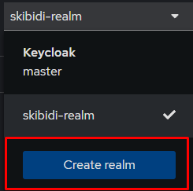
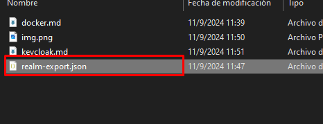
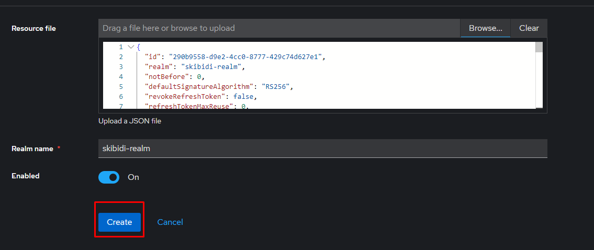

# Instrucciones para correr keycloak
**Asegurense de que el engine de docker este corriendo.**

1. Correr el siguiente comando para iniciar el contenedor:
```bash
docker run -p 8080:8080 --name sk-keycloak -e KEYCLOAK_ADMIN=admin -e KEYCLOAK_ADMIN_PASSWORD=admin quay.io/keycloak/keycloak:25.0.5 start-dev
```
Las creedenciales son: admin y admin.

2. Para que todos tengamos el mismo realm, está el archivo *realm-export.json* en esta misma carpeta tiene que:
    - Ir a la pestaña de *Import* en la consola de Keycloak.
   
    - Seleccionar el archivo *realm-export.json*.
   
    - Dar click en *Create*.
   
